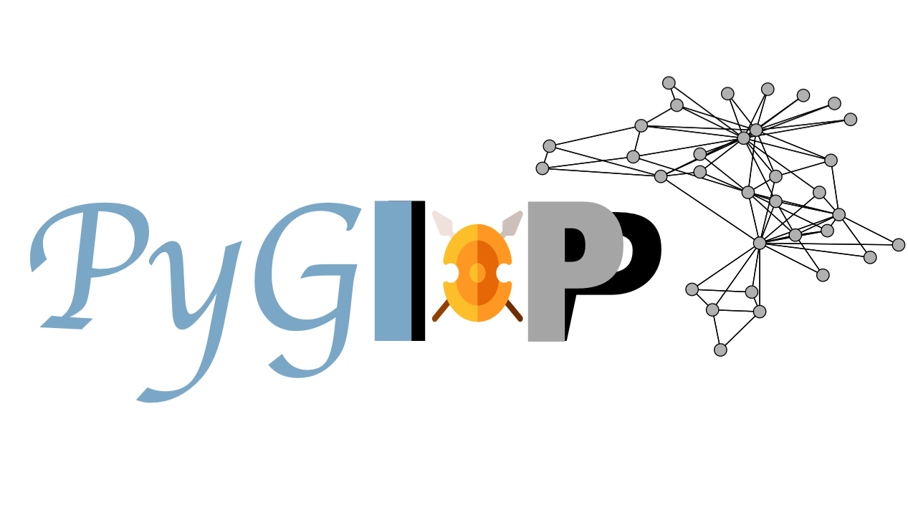
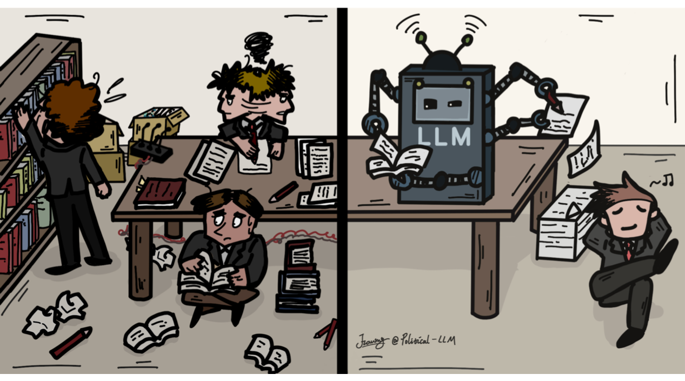
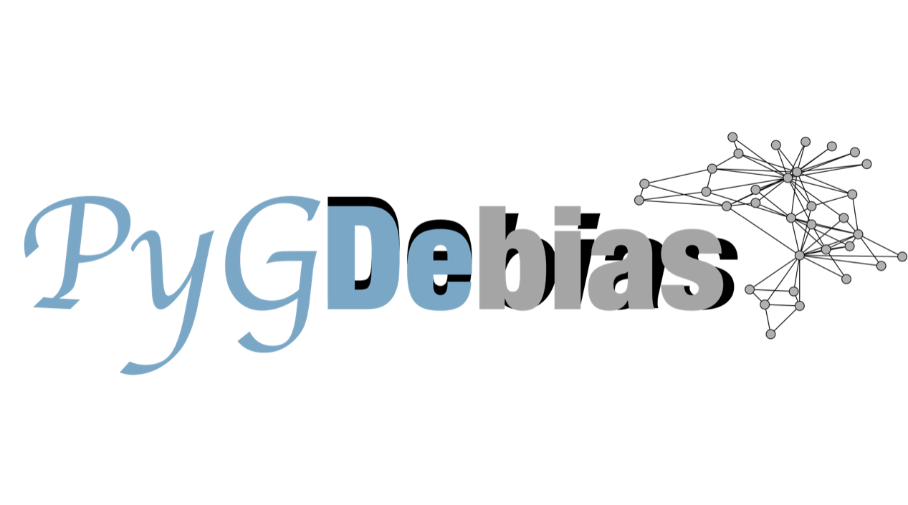

# AI + Privacy

  <!-- PyGIP -->
  

    
  

  

    <b>PyGIP</b> is a comprehensive Python library focused on model extraction attacks and defenses in Graph Neural Networks (GNNs). Built on PyTorch, PyTorch Geometric, and DGL, the library offers a robust framework for understanding, implementing, and defending against attacks targeting GNN models. Check [our Github Repo](https://github.com/LabRAI/PyGIP) and [our Official Website](https://labrai.github.io/PyGIP/)!
  

 

# AI + Security

  
  <!-- PyOD V2 -->
  

    
  

  

    <b>PyOD</b> includes more than 50 detection algorithms, from classical LOF (SIGMOD 2000) to the cutting-edge ECOD and DIF (TKDE 2022 and 2023). Since 2017, PyOD has been successfully used in numerous academic research projects and commercial products with more than <b>26 million downloads</b>.
  

 

# AI + Social Science

  <!-- Political-LLM -->
  

    
  

  

    What if large language models (LLMs) could transform how we understand politics? This project introduces <b>Political-LLM</b>, the first comprehensive framework to systematically integrate LLMs into political science research. It bridges computer science and political science by providing a taxonomy, technical insights, and ethical considerations to guide impactful LLM applications in the political domain.
  

 

# AI + Social Good

  <!-- PyGDebias -->
  

    
  

  

    <b>PyGDebias</b> aims to provide a systematic schema to load datasets and compare different debiasing techniques for graph learning algorithms. Specifically, 26 graph datasets (including 24 commonly used ones and two newly constructed ones, AMiner-L and AMiner-S) are collected, and 13 algorithms are implemented in this library.
  

