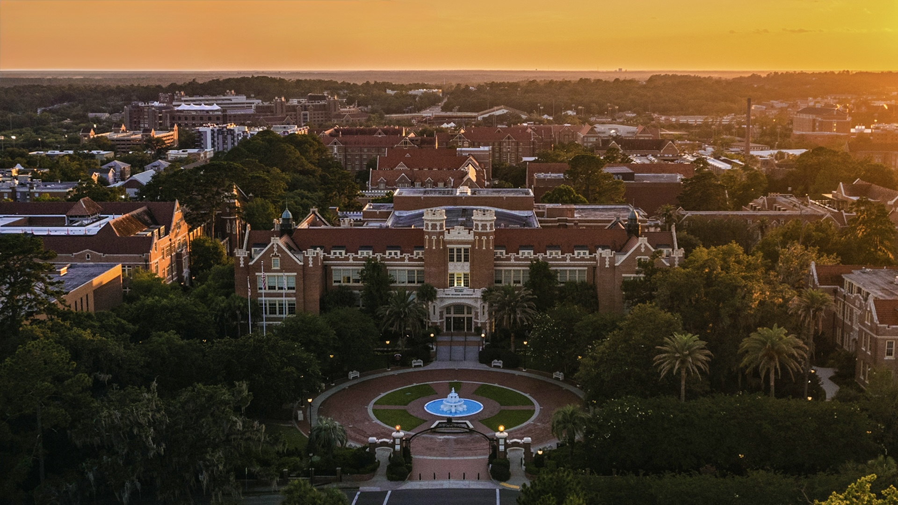

  

 

## RAI Logo

  

    
  

  

    I lead the Responsible AI (RAI) Lab at Florida State University, Tallahassee, FL. This logo, where the "R" is placed in front of "AI", was conceptualized to emphasize that making AI responsible is even more important than developing AI technology itself. I am truly fortunate to work with such talented and enthusiastic PhD students and research interns listed below. 
  

## RAI Activities

RAI Lab has been hosting [**Student Seminar at Computer Science Department**](https://www.cs.fsu.edu/seminars/) since 2024, providing the students in FSU a wonderful platform to meet peers who are interested in various research topics, mentors who are recruiting students (e.g., PhD students, interns, GTAs, and GRAs), and leadership personnel sharing wonderful achievements of the FSU Computer Science Department. We will provide **free lunch** at each of the seminars and invite speakers to share their state-of-the-art research progress and their personal journey experience. **Come and join us for presentation, discussion, or just lunch!**

## Faculty

[**Yushun Dong**](https://yushundong.github.io)

## PhD Students

[**Lincan Li**](https://lincanli98.github.io), Spring 2025 - 

[**Bolin Shen**](https://blshen.org), Spring 2025 - 

[**Xueqi Cheng**](https://xueqic.github.io), Fall 2025 - 

[**Yangshuang Xu**](https://www.linkedin.com/in/yangshuang-xu-424160259/) (Visiting), Fall 2025 - 

[**Ryan Leigh**](https://www.linkedin.com/in/ryan-leigh-ba9b61112/), Fall 2025 - 

Recruiting...

## Master and Undergrad Students

## Alumni Highlights

**Zebin Wang**  
**Achievement at RAI Lab**: ICML 2025 publication.  
**Last Known Position**: PhD student at Harvard University.    

**Menghan Lin**   
**Achievement at RAI Lab**: ICML 2025 publication.  
**Last Known Position**: Data Scientist at Meta.   

**Ken Anderson**   
**Achievement at RAI Lab**: ICML 2025 publication.  
**Last Known Position**: Undergrad student at FSU.

**Kaixiang Zhao**   
**Achievement at RAI Lab**: SIGKDD 2025 publication; SIGKDD 2025 tutorial.  
**Last Known Position**: Undergrad student at University of Notre Dame.

**Zhan Cheng**   
**Achievement at RAI Lab**: SIGKDD 2025 publication.  
**Last Known Position**: Undergrad student at University of Wisconsin–Madison.

