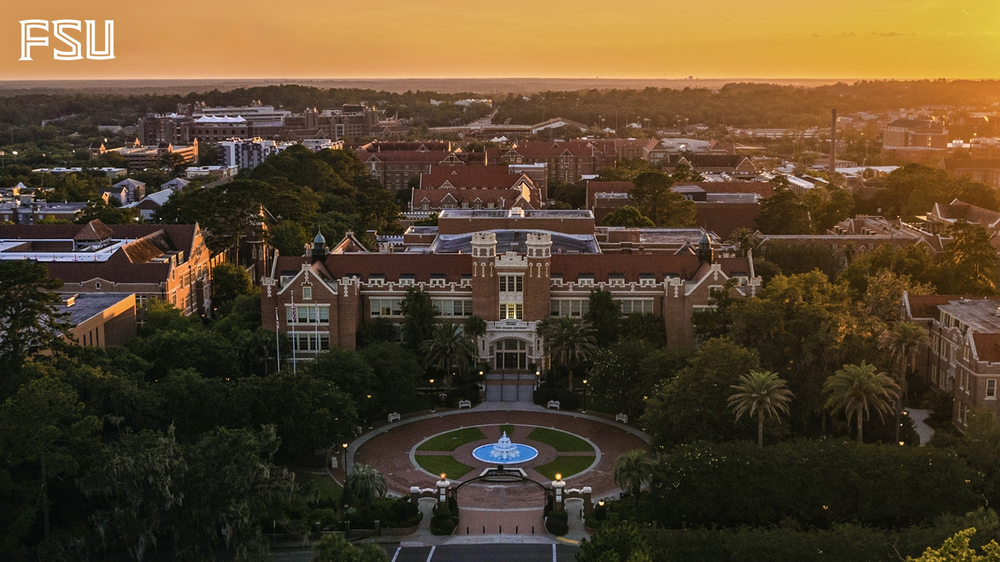
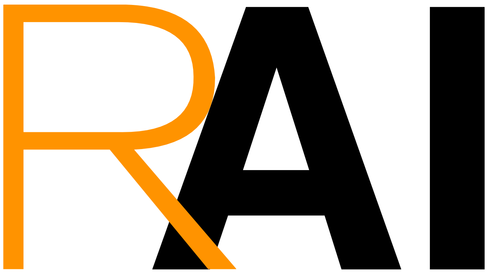

  

    
  

  

    I lead the Responsible AI (RAI) Lab at Florida State University, Tallahassee, FL. This logo, where the "R" is placed in front of "AI", was conceptualized to emphasize that making AI responsible is even more important than developing AI technology itself. I am truly fortunate to work with such talented and enthusiastic PhD students and research interns listed below. 
  

-------------------
## Faculty

[**Yushun Dong**](https://yushundong.github.io)

-------------------
## PhD Students

[**Lincan Li**](https://lincanli98.github.io), Spring 2025 - 

[**Bolin Shen**](https://blshen.org), Spring 2025 - 

Recruiting...

-------------------
## Master and Undergrad Students

-------------------
## Alumni

**Zebin Wang** 
**Achievements**: ICML 2025 publication * 1.
**Last Known Position**: PhD student at Harvard University.  

**Menghan Lin** 
**Achievements**: ICML 2025 publication * 1.
**Last Known Position**: Data Scientist at Meta.

