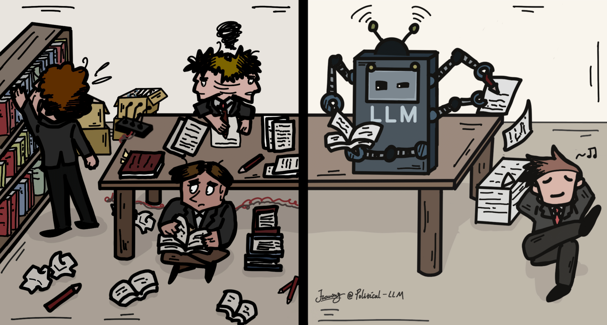
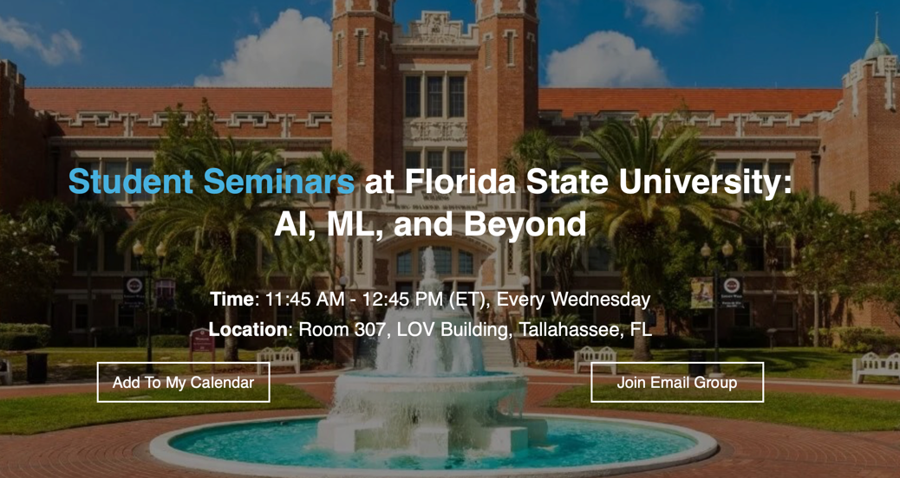

  

    
  

  

    I lead the Responsible AI (RAI) Lab at Florida State University, Tallahassee, FL. This logo, where the "R" is placed in front of "AI", was conceptualized to emphasize that making AI responsible is even more important than developing AI technology itself. I am truly fortunate to work with such talented and enthusiastic PhD students and research interns listed below. 
  

-------------------
## PhD Students

[Lincan Li](https://lincanli98.github.io), Spring 2025 - 

Bolin Shen, Spring 2025 - 

Recruiting...

-------------------
## Open-Source Projects at RAI Lab

  

    
  

  

    [Political-LLM](https://arxiv.org/abs/2412.06864) is a comprehensive guidebook based on the collaboration of 40+ researchers across AI and political science field exploring how LLMs are revolutionizing political science research. Click to read [paper](https://arxiv.org/abs/2412.06864) and [online resources](http://political-llm.org).
  

  

    
  

  

    [**PyGDebias**](https://github.com/yushundong/PyGDebias) provides a systematic schema to load datasets and compare different debiasing techniques for graph learning algorithms. Specifically, 26 graph datasets (including 24 commonly used ones and two newly constructed ones, AMiner-L and AMiner-S) are collected, and 13 algorithms are implemented in this library.
  

  

    
  

  

    [**FSu Student Seminar**](https://www.cs.fsu.edu/seminars/) aims to foster a seminar series as a dynamic intellectual hub dedicated to introducing and advancing the cutting-edge of computer science for the students at the academic community of FSU, with a particular focus on artificial intelligence, machine learning, and related emerging technologies. This regular seminar serves as a platform for faculty and students to share groundbreaking discoveries, innovative methodologies, and critical insights across the rapidly evolving landscape of computational sciences. By promoting interdisciplinary dialogue and collaboration, this seminar aims to catalyze innovation and cross-pollination of ideas spanning various domains within and beyond traditional computer science boundaries. It offers an essential opportunity for participants to engage with the latest advancements, challenge conventional paradigms, and inspire novel research directions.
  

